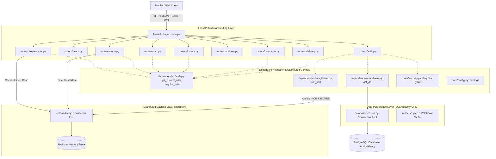
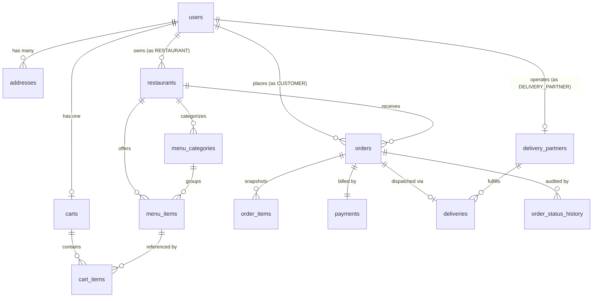
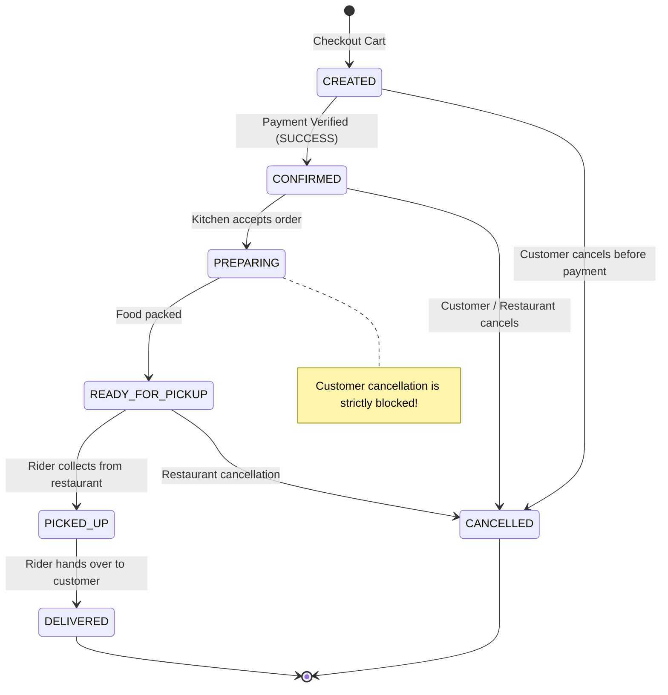
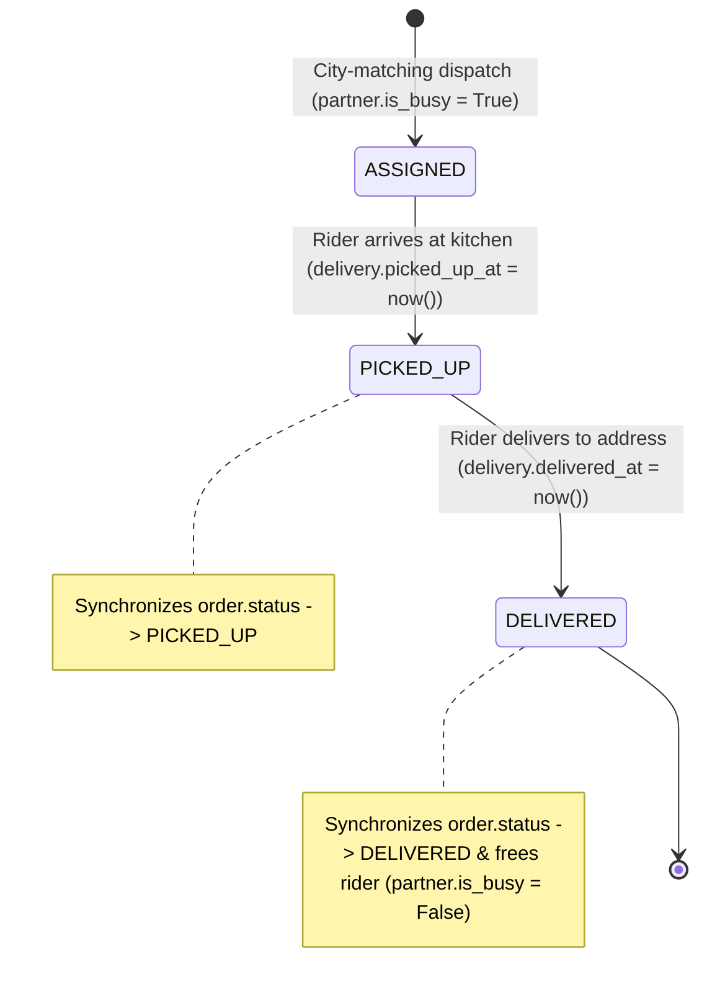

# System Architecture: Food Delivery Platform (Stages 1 & 2)

This document provides a comprehensive structural and behavioral breakdown of the **Food Delivery Platform Backend**, built using **FastAPI**, **PostgreSQL**, **Redis**, **SQLAlchemy 2.0+**, **Pydantic v2**, and **Bcrypt/JWT**.

---

## 1. High-Level Architecture Overview

The system is architected as a **Layered Modular Monolith with Distributed Caching**. Each domain is isolated into its own models, schemas, and routers, while sharing common infrastructure (database sessions, security utilities, and Redis caching).



---

## 2. Directory Structure & File Mapping

| Directory / Layer | Purpose | Exact File Locations |
| :--- | :--- | :--- |
| **Core Configuration & Infrastructure** | Environment variables, cryptographic hashing, JWT tokens, and Redis client | [app/core/config.py](file:///Users/macbookpro/Desktop/food-delivery-platform/food_delivery_be/app/core/config.py)<br>[app/core/security.py](file:///Users/macbookpro/Desktop/food-delivery-platform/food_delivery_be/app/core/security.py)<br>[app/core/redis.py](file:///Users/macbookpro/Desktop/food-delivery-platform/food_delivery_be/app/core/redis.py) |
| **Database Engine** | Connection pool, declarative base, and session factory | [app/database/base.py](file:///Users/macbookpro/Desktop/food-delivery-platform/food_delivery_be/app/database/base.py)<br>[app/database/session.py](file:///Users/macbookpro/Desktop/food-delivery-platform/food_delivery_be/app/database/session.py) |
| **ORM Models** | 13 Relational Database Tables | [app/models/user.py](file:///Users/macbookpro/Desktop/food-delivery-platform/food_delivery_be/app/models/user.py)<br>[app/models/restaurant.py](file:///Users/macbookpro/Desktop/food-delivery-platform/food_delivery_be/app/models/restaurant.py)<br>[app/models/menu.py](file:///Users/macbookpro/Desktop/food-delivery-platform/food_delivery_be/app/models/menu.py)<br>[app/models/cart.py](file:///Users/macbookpro/Desktop/food-delivery-platform/food_delivery_be/app/models/cart.py)<br>[app/models/address.py](file:///Users/macbookpro/Desktop/food-delivery-platform/food_delivery_be/app/models/address.py)<br>[app/models/order.py](file:///Users/macbookpro/Desktop/food-delivery-platform/food_delivery_be/app/models/order.py)<br>[app/models/payment.py](file:///Users/macbookpro/Desktop/food-delivery-platform/food_delivery_be/app/models/payment.py)<br>[app/models/delivery.py](file:///Users/macbookpro/Desktop/food-delivery-platform/food_delivery_be/app/models/delivery.py) |
| **Pydantic Schemas** | Request validation and response serialization | [app/schemas/user.py](file:///Users/macbookpro/Desktop/food-delivery-platform/food_delivery_be/app/schemas/user.py)<br>[app/schemas/restaurant.py](file:///Users/macbookpro/Desktop/food-delivery-platform/food_delivery_be/app/schemas/restaurant.py)<br>[app/schemas/menu.py](file:///Users/macbookpro/Desktop/food-delivery-platform/food_delivery_be/app/schemas/menu.py)<br>[app/schemas/cart.py](file:///Users/macbookpro/Desktop/food-delivery-platform/food_delivery_be/app/schemas/cart.py)<br>[app/schemas/address.py](file:///Users/macbookpro/Desktop/food-delivery-platform/food_delivery_be/app/schemas/address.py)<br>[app/schemas/order.py](file:///Users/macbookpro/Desktop/food-delivery-platform/food_delivery_be/app/schemas/order.py)<br>[app/schemas/payment.py](file:///Users/macbookpro/Desktop/food-delivery-platform/food_delivery_be/app/schemas/payment.py)<br>[app/schemas/delivery.py](file:///Users/macbookpro/Desktop/food-delivery-platform/food_delivery_be/app/schemas/delivery.py) |
| **FastAPI Dependencies** | Request-scoped DB sessions, JWT extraction, RBAC, and Redis rate limiting | [app/dependencies/database.py](file:///Users/macbookpro/Desktop/food-delivery-platform/food_delivery_be/app/dependencies/database.py)<br>[app/dependencies/auth.py](file:///Users/macbookpro/Desktop/food-delivery-platform/food_delivery_be/app/dependencies/auth.py)<br>[app/dependencies/rate_limiter.py](file:///Users/macbookpro/Desktop/food-delivery-platform/food_delivery_be/app/dependencies/rate_limiter.py) |
| **Domain Routers** | HTTP controllers and business logic controllers | [app/routers/auth.py](file:///Users/macbookpro/Desktop/food-delivery-platform/food_delivery_be/app/routers/auth.py)<br>[app/routers/users.py](file:///Users/macbookpro/Desktop/food-delivery-platform/food_delivery_be/app/routers/users.py)<br>[app/routers/restaurants.py](file:///Users/macbookpro/Desktop/food-delivery-platform/food_delivery_be/app/routers/restaurants.py)<br>[app/routers/menu.py](file:///Users/macbookpro/Desktop/food-delivery-platform/food_delivery_be/app/routers/menu.py)<br>[app/routers/cart.py](file:///Users/macbookpro/Desktop/food-delivery-platform/food_delivery_be/app/routers/cart.py)<br>[app/routers/address.py](file:///Users/macbookpro/Desktop/food-delivery-platform/food_delivery_be/app/routers/address.py)<br>[app/routers/orders.py](file:///Users/macbookpro/Desktop/food-delivery-platform/food_delivery_be/app/routers/orders.py)<br>[app/routers/payments.py](file:///Users/macbookpro/Desktop/food-delivery-platform/food_delivery_be/app/routers/payments.py)<br>[app/routers/delivery.py](file:///Users/macbookpro/Desktop/food-delivery-platform/food_delivery_be/app/routers/delivery.py) |
| **Entry Point** | App initialization, router mounting, and startup schema creation | [app/main.py](file:///Users/macbookpro/Desktop/food-delivery-platform/food_delivery_be/app/main.py) |

---

## 3. Relational Database Entity-Relationship Diagram (ERD)

The database schema consists of **13 normalized tables** connected via foreign keys with explicit cascading delete strategies.



---

## 4. Finite State Machines (FSM)

### A. Order Lifecycle State Machine
Orders transition strictly according to the transition graph defined in [routers/orders.py](file:///Users/macbookpro/Desktop/food-delivery-platform/food_delivery_be/app/routers/orders.py).



### B. Delivery Fulfillment State Machine


---

## 5. Core Architectural Decisions & Placement Concepts

### 1. Integer Currency Representation (Paise/Cents)
* **File Reference**: [app/models/menu.py](file:///Users/macbookpro/Desktop/food-delivery-platform/food_delivery_be/app/models/menu.py), [app/models/order.py](file:///Users/macbookpro/Desktop/food-delivery-platform/food_delivery_be/app/models/order.py), [app/models/payment.py](file:///Users/macbookpro/Desktop/food-delivery-platform/food_delivery_be/app/models/payment.py)
* **Concept**: IEEE 754 floating-point arithmetic is non-exact (`0.1 + 0.2 = 0.30000000000000004`). In a billing and ledger system, floating-point rounding errors compound over millions of transactions.
* **Implementation**: All prices, subtotals, delivery fees, and grand totals are stored as standard `Integer` columns representing the smallest denomination (paise). ₹340.00 is stored as `34000`.

### 2. Concurrency Control with Row-Level Locking (`SELECT FOR UPDATE`)
* **File Reference**: [app/routers/orders.py](file:///Users/macbookpro/Desktop/food-delivery-platform/food_delivery_be/app/routers/orders.py)
* **Concept**: Prevent the **Overselling / Double-Dipping Problem**. If two users checkout the last Biryani (`stock = 1`) simultaneously, a standard `SELECT` query would read `1` in both transactions and decrement both to `0`, resulting in an oversell.
* **Implementation**: We invoke `.with_for_update()` in SQLAlchemy. In PostgreSQL, this issues `SELECT * FROM menu_items WHERE id = ? FOR UPDATE`, placing an exclusive row-level write lock. The second transaction pauses until the first transaction commits or rolls back, reading the updated stock and preventing negative inventory.

### 3. Price Snapshotting (Historical Invariance)
* **File Reference**: [app/models/order.py](file:///Users/macbookpro/Desktop/food-delivery-platform/food_delivery_be/app/models/order.py)
* **Concept**: Historical receipts must never mutate if a restaurant changes menu prices.
* **Implementation**: `OrderItem` does not just store a foreign key pointer `menu_items.id`. It explicitly freezes `item_name`, `unit_price`, and `subtotal` at the exact moment of order placement.

### 4. Single-Restaurant Cart Constraint & Conflict Resolution
* **File Reference**: [app/routers/cart.py](file:///Users/macbookpro/Desktop/food-delivery-platform/food_delivery_be/app/routers/cart.py)
* **Concept**: A customer cannot order from two restaurants simultaneously because a single driver cannot pick up from two distinct kitchens across town without violating SLAs.
* **Implementation**: The `Cart` entity maintains a `restaurant_id` foreign key. Adding an item from Restaurant B when Restaurant A items exist triggers `HTTP 409 Conflict`. Clients can pass `clear_existing: true` to purge the old items and rebind the cart to the new restaurant atomically.

### 5. Payment Idempotency Keys
* **File Reference**: [app/routers/payments.py](file:///Users/macbookpro/Desktop/food-delivery-platform/food_delivery_be/app/routers/payments.py)
* **Concept**: Prevent double charging when customers tap "Pay" twice or when mobile networks retry failed HTTP packets.
* **Implementation**: `payments.idempotency_key` is marked `UNIQUE` and indexed. If a request arrives with an already-processed key, the backend bypasses the payment gateway and returns the existing transaction immediately.

### 6. Cache-Aside Pattern & Active Invalidation (Redis)
* **File Reference**: [app/core/redis.py](file:///Users/macbookpro/Desktop/food-delivery-platform/food_delivery_be/app/core/redis.py), [app/routers/restaurants.py](file:///Users/macbookpro/Desktop/food-delivery-platform/food_delivery_be/app/routers/restaurants.py), [app/routers/menu.py](file:///Users/macbookpro/Desktop/food-delivery-platform/food_delivery_be/app/routers/menu.py)
* **Concept**: Sub-millisecond reads without stale data.
* **Implementation**: `GET /restaurants/{id}/menu` reads from Redis (`X-Cache: HIT`). On cache miss, it reads PostgreSQL, sets Redis with a 300s TTL (`X-Cache: MISS`). Any menu mutation (`POST /items`, `PATCH /items`, `DELETE /items`) evicts the key immediately, preventing stale customer views. Uses cursor-based `SCAN` rather than blocking `KEYS *` for pattern invalidation.

### 7. Distributed API Rate Limiting (Redis INCR + EXPIRE)
* **File Reference**: [app/dependencies/rate_limiter.py](file:///Users/macbookpro/Desktop/food-delivery-platform/food_delivery_be/app/dependencies/rate_limiter.py)
* **Concept**: Defends authentication endpoints against distributed brute-force attacks across horizontally scaled instances.
* **Implementation**: Atomic Redis `INCR` and `EXPIRE` window tracker. Enforces 5 requests per 60 seconds per IP on `/auth/login`, returning `HTTP 429 Too Many Requests` with `Retry-After` header.

### 8. Redis Distributed Locking (`SET NX EX` + Atomic Lua Release)
* **File Reference**: [app/core/redis.py](file:///Users/macbookpro/Desktop/food-delivery-platform/food_delivery_be/app/core/redis.py)
* **Concept**: When multiple backend instances service requests concurrently, critical sections across mutable distributed state (such as user cart checkout and payment processing) require mutual exclusion.
* **Implementation**:
  - **Acquisition**: `redis_client.set(lock_key, token, nx=True, ex=lock_timeout_seconds)`. Uses a cryptographically random UUID `token`.
  - **Deadlock Defense**: An explicit TTL (`lock_timeout_seconds`) guarantees locks self-expire if a worker process crashes mid-transaction.
  - **Safe Atomic Release (Lua Script)**:
    ```lua
    if redis.call("get", KEYS[1]) == ARGV[1] then
        return redis.call("del", KEYS[1])
    else
        return 0
    end
    ```
    Guarantees that a process whose lock expired prematurely cannot accidentally delete a replacement lock acquired by another process.

### 9. Multi-Layer Distributed Idempotency (Redis Fast-Path + DB Constraint)
* **File Reference**: [app/routers/orders.py](file:///Users/macbookpro/Desktop/food-delivery-platform/food_delivery_be/app/routers/orders.py), [app/models/order.py](file:///Users/macbookpro/Desktop/food-delivery-platform/food_delivery_be/app/models/order.py)
* **Concept**: Mobile apps and browser clients routinely retry requests on network timeouts or double-tap checkout buttons. In food delivery systems, duplicate orders lead to double billing and kitchen waste.
* **Implementation**:
  - **Layer 1 (Redis In-Flight & Cache)**:
    - Key: `idempotency:order:{user_id}:{idempotency_key}`
    - If status is `COMPLETED`, the completed `order_id` is returned immediately without reaching PostgreSQL.
    - If status is `PROCESSING`, returns `HTTP 409 Conflict` to block concurrent duplicate submissions.
  - **Layer 2 (PostgreSQL Unique Constraint)**:
    - Column `orders.idempotency_key VARCHAR(100) UNIQUE INDEX`.
    - Guarantees defense-in-depth data integrity even during Redis eviction or disaster recovery.

### 10. Deadlock-Free Inventory Row Locking (Deterministic Lock Ordering)
* **File Reference**: [app/routers/orders.py](file:///Users/macbookpro/Desktop/food-delivery-platform/food_delivery_be/app/routers/orders.py)
* **Concept**:
  - If Customer 1 orders items `[A, B]` and Customer 2 orders items `[B, A]`, concurrent checkouts will cause a classic **PostgreSQL Deadlock**: Customer 1 locks row A and waits for row B, while Customer 2 locks row B and waits for row A. PostgreSQL's deadlock detector must abort one transaction with `DeadlockDetected`.
* **Implementation (Dijkstra's Resource Hierarchy)**:
  - All items in the cart are deterministically sorted by ascending `item_id`:
    ```python
    sorted_cart_items = sorted(cart.items, key=lambda ci: ci.item_id)
    ```
  - Because all concurrent database transactions lock `menu_items` rows in strictly increasing primary key order, deadlocks are mathematically impossible.

### 11. Driver Dispatch Queue Concurrency (`SELECT FOR UPDATE SKIP LOCKED`)
* **File Reference**: [app/routers/delivery.py](file:///Users/macbookpro/Desktop/food-delivery-platform/food_delivery_be/app/routers/delivery.py)
* **Concept**:
  - In a high-traffic meal rush, multiple restaurant orders are dispatched simultaneously in the same city.
  - If multiple dispatch workers query `is_online=True AND is_busy=False` concurrently with standard `SELECT`, they all match the same rider, causing **driver double-booking**.
  - If they use regular `FOR UPDATE`, all workers block in a lock queue waiting for the first rider.
* **Implementation**:
  - We use PostgreSQL's `SELECT ... FOR UPDATE SKIP LOCKED`:
    ```python
    partner = (
        db.query(DeliveryPartner)
        .filter(
            DeliveryPartner.current_city.ilike(restaurant.city),
            DeliveryPartner.is_online == True,
            DeliveryPartner.is_busy == False
        )
        .with_for_update(skip_locked=True)
        .first()
    )
    ```
  - Worker 1 locks Rider A.
  - Worker 2 concurrently skips locked Rider A without pausing and immediately locks Rider B.
  - If no riders remain unlocked, it returns `None` immediately, returning `503 Service Unavailable` with zero latency and zero lock contention.

---

## Concurrency Test Suite Verification Matrix

Automated multi-threaded test suite: [tests/test_concurrency.py](file:///Users/macbookpro/Desktop/food-delivery-platform/food_delivery_be/tests/test_concurrency.py)

| Test Scenario | Concurrency Level | Tested Invariant | Result |
| :--- | :--- | :--- | :--- |
| **Overselling Prevention** | 10 parallel threads competing for 2 stock units | `SELECT FOR UPDATE` prevents negative stock; exactly 2 orders placed, 8 rejected with 400 | **100% PASS** (Final stock: 0) |
| **Order Idempotency** | 5 simultaneous checkouts with identical key | Exactly 1 order created in DB; all 5 requests receive 201 with identical order ID | **100% PASS** (Single order created) |
| **Payment Idempotency** | 5 concurrent payments for the same order | Distributed lock serializes payments; exactly 1 payment record created, order CONFIRMED | **100% PASS** (Single payment record) |
| **Driver Double-Booking** | 3 concurrent order dispatches competing for 1 rider | `SKIP LOCKED` assigns rider to exactly 1 order; remaining 2 fail with 503 | **100% PASS** (Zero double-booking) |

---

### 12. Real-Time WebSockets & Distributed Redis Pub/Sub
* **File Reference**: [app/routers/websockets.py](file:///Users/macbookpro/Desktop/food-delivery-platform/food_delivery_be/app/routers/websockets.py), [app/core/events.py](file:///Users/macbookpro/Desktop/food-delivery-platform/food_delivery_be/app/core/events.py)
* **Concept**:
  - Polling HTTP endpoints (`GET /orders/{id}`) every few seconds creates heavy database connection thrashing and CPU load.
  - In a distributed multi-pod environment, a client's persistent WebSocket connection is held on Server Instance A, while the order state transition occurs on Server Instance B (e.g., kitchen marks `PREPARING` or driver assigns).
* **Implementation**:
  - We use **Redis Pub/Sub** (`aioredis` channel `channel:order:{order_id}`) as the distributed event broker.
  - When Instance B changes order status, it publishes an event payload to Redis.
  - Instance A (subscribed via async event loop) immediately intercepts the Redis message and forwards it down the active WebSocket connection to the client in `<5ms`.
  - Also logs events into Redis list `timeline:order:{order_id}` with 7-day TTL so reconnected clients receive the complete historical timeline immediately upon handshake.

### 13. Driver Geolocation Telemetry, Redis Geospatial & Dynamic ETA Engine
* **File Reference**: [app/services/telemetry.py](file:///Users/macbookpro/Desktop/food-delivery-platform/food_delivery_be/app/services/telemetry.py), [app/routers/delivery.py](file:///Users/macbookpro/Desktop/food-delivery-platform/food_delivery_be/app/routers/delivery.py)
* **Concept**:
  - High-frequency GPS telemetry (every 5–10s) from thousands of drivers cannot be written to relational disk without saturating IOPS.
* **Implementation**:
  - Coordinates are stored in **Redis Geospatial Index** (`GEOADD geo:delivery_partners longitude latitude partner_id`).
  - Distance between rider and restaurant/customer is computed via great-circle Haversine formula in meters.
  - Dynamic ETA is estimated with speed profile:
    $$\text{ETA (minutes)} = \max\left(1, \left\lceil \frac{\text{Distance (meters)}}{416.0 \text{ m/min}} \right\rceil + 3.0 \text{ min buffer}\right)$$
  - Each location ping publishes a `DRIVER_LOCATION_UPDATED` event to the active order's channel, streaming live coordinates, distance, and dynamic ETA directly to the customer's map view.

### 14. Asynchronous Background Notification Bus
* **File Reference**: [app/services/notifications.py](file:///Users/macbookpro/Desktop/food-delivery-platform/food_delivery_be/app/services/notifications.py)
* **Concept**:
  - External communication (push notifications, SMS, emails) is prone to network latency and third-party gateway timeouts.
* **Implementation**:
  - Leverages FastAPI's `BackgroundTasks` to offload notification formatting and dispatch outside the request-response thread.
  - Pushes audit copies to Redis inbox `notifications:user:{user_id}` and `notifications:audit_log`, providing immediate sub-millisecond API response times (`<20ms`).

---

## Stage 4 Real-Time & Event-Driven Verification Matrix

Automated end-to-end WebSocket and event test suite: [tests/test_stage4_events.py](file:///Users/macbookpro/Desktop/food-delivery-platform/food_delivery_be/tests/test_stage4_events.py)

| Test Step | Action Under Test | Real-Time Push Invariant Verified | Result |
| :--- | :--- | :--- | :--- |
| **Step 1** | WebSocket Handshake | Connection established, auth validated, initial state snapshot returned | **100% PASS** |
| **Step 2** | `POST /payments/` | `PAYMENT_SUCCESS` & `ORDER_CONFIRMED` pushed over socket | **100% PASS** |
| **Step 3** | `PATCH /orders/{id}/status` | `ORDER_PREPARING` pushed to customer socket | **100% PASS** |
| **Step 4** | `PATCH /orders/{id}/status` | `ORDER_READY_FOR_PICKUP` pushed over socket | **100% PASS** |
| **Step 5** | `POST /delivery/assign/{id}` | `DRIVER_ASSIGNED` broadcast with rider name & vehicle number | **100% PASS** |
| **Step 6** | `POST /delivery/location` | `DRIVER_LOCATION_UPDATED` streamed with live lat/lon & dynamic ETA | **100% PASS** |
| **Step 7** | `PATCH /delivery/{id}/status` | `ORDER_PICKED_UP` pushed over socket | **100% PASS** |
| **Step 8** | `PATCH /delivery/{id}/status` | `ORDER_DELIVERED` final completion event pushed | **100% PASS** |
| **Step 9** | `GET /ws/notifications` | Verified 4 asynchronous notifications in user's Redis inbox | **100% PASS** |


